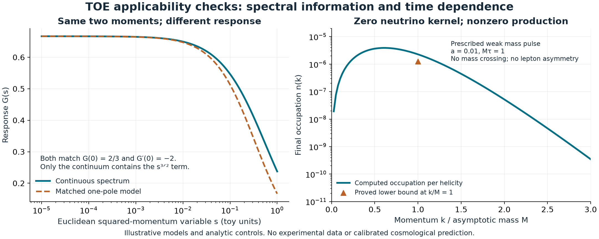

> Public adaptation prepared 30 September 2026. The original scientific checkpoint was local work dated 6 September; its publication status has changed, not its scientific scope.

# Unified Theory of Everything — research checkpoint, 6 September 2026

**The main advance is an explicit calculation of the dimension-seven seed bubble left unresolved in N00AK-r1.** Its momentum dependence differs from the earlier proposed shortcut. Two independent analytic reviews agree with the new calculation. This gives the project a concrete starting point for the remaining operator matching.

This continues the **Unified Theory of Everything** project. The user's clarification that the higher-dimensional-blast wording belonged to another chat is controlling. Other research projects were consulted as references. Their results are not being combined into one physical theory, and the separate D-blast task's calculations are not claimed as new work here.

## 1. The next TOE loop calculation is now explicit

N00AK-r1 preserved the exact heavy-neutrino tree kernel while withdrawing the claim that its dimension-seven loop coefficient had been derived. The missing step concerned two different ways to pair lepton and Higgs fields. One derivative acts on a fixed external momentum; the other carries momentum circulating through the loop.

We have now integrated that declared seed diagram with both pairings retained. Let p be the incoming sterile momentum, r the outgoing lepton momentum, h the outgoing Higgs momentum, and p=r+h. After removing a common loop factor and fixing the seed's momentum-space sign convention, the resulting polynomial is

\[
\boxed{
\not J=
\left(\frac56p^2+\frac13r^2+\frac16h^2+\frac12m_H^2\right)\not p
+\left(\frac12m_H^2-\frac16p^2\right)\not r.
}
\]

Here m_H² is the scalar propagator's mass parameter. The old shortcut retained only(3/2)p² slash-p. The additional terms cannot be reproduced by changing a single number. A simple off-shell example even makes the two resulting vectors point in different directions.

The calculation was obtained through Feynman-parameter tensor reduction and separately through a large-loop-momentum expansion. A reviewer worked with the original reference's opposite loop orientation and recovered the same result, including mass terms. A further reviewer checked the field pairing and relative factors. The executable root check passes 815 exact rational controls.

**What this establishes:** an evaluated ultraviolet polynomial for one specified derivative seed. **What remains:** the complete operator basis, gauge completion, sourced equations of motion, induced contact terms and physical running coefficients. The projected ratio 5/9 is not a license to replace the old proposed beta-function factor 3 with 5/3. The explicit operator image must be derived first.

Read [the full routed calculation](routed_loop/ROUTED_BUBBLE.md), [the independent tensor derivation](routed_loop_independent.md), and [the separate vertex review](routed_loop/SEED_VERTEX_REVIEW.md). The published baseline remains [TOE-N00AK-r1](https://zenodo.org/records/22319172); its correction has not been overwritten or reversed.

## 2. An older TOE scalar model supplies a useful spectral restriction

The folder search recovered the full v294 scalar theorem in folder 152. Under its inherited operator assumptions, its spectrum is continuous down to zero. That differs from the finite set of heavy-neutrino poles used in N00AK. The two mathematical descriptions cannot automatically use the same low-energy expansion.

For a positive scalar spectral density behaving as lambda^beta near zero, the nth local response coefficient is finite only when n<beta. The next contribution generally contains a fractional power; at integer exponents it contains a logarithm. A few exact static coefficients therefore do not establish an exact finite-pole model.

We derived the useful positive-measure bound

\[
\boxed{G_E(s)\ge\frac{\mu_0^2}{\mu_0+s\mu_1},\qquad s>0.}
\]

The right side is the unique positive single-pole model matching the static value and its first derivative. It is a lower bound in this Euclidean setting, not a reconstruction of the full continuum. An explicit example has identical first two moments in both models, while only the continuum contains a pi*s^(3/2) term and a continuous spectral discontinuity.

This is a controlled application of established spectral mathematics. Positivity belongs to the scalar branch; N00AK's complex-symmetric Majorana residues do not generally satisfy it. The parent v294 spectral theorem was read as an inherited premise, not re-proved here. Read [the conditional derivation and exact example](continuum_bridge/continuum_eft_bridge.md).

## 3. A secondary neutrino diagnostic: cancellation does not measure all dynamics

For two degenerate heavy Majorana states, choose M(t)=m(t)I and Y=y(1,i). Then the lepton-number-violating coefficient C5=Y M^-1 Y^T vanishes exactly whenever m is nonzero. All corresponding stationary LNV moments vanish as well.

Nevertheless, an externally prescribed weak mass pulse can produce heavy particle–antiparticle pairs. For the explicit pulse m/M=1-0.01*sech²(t/tau), with M*tau=1 and momentum k/M=1, a unitary remainder estimate proves

\[
\boxed{n_k>\frac{259081}{207025000000}>1.25\times10^{-6}.}
\]

The mass stays at least 0.99M throughout; no mass crossing is required. This exposes a precise limitation: cancellation in a lepton-number-violating kernel cannot establish the absence of every dynamical process. The example preserves lepton number and produces no lepton asymmetry. Its prescribed background, couplings and scale have not been derived from the TOE action or fitted to observations.

Six numerical pulse cases pass independent solver comparisons, refinement checks, zero-production controls and norm checks. A separate rotated-basis implicit solver agrees on selected modes within 5.15e-8. The analytic weak-pulse lower bound is stronger evidence for nonzero production than the plots alone. Floating spectra and finite-band integrals are numerical diagnostics, not rigorous cosmological abundance predictions. Read [the analytic counterexample](dynamic_eft_review.md) and [the numerical review](fermion_portal/INDEPENDENT_NUMERICAL_REVIEW.md).

## 4. What the recent literature contributes

The focused primary-source search identified ten useful papers. Three particularly relevant updates are:

- An August 2026 scalar–seesaw study compares tree matching in both heavy-threshold orders. It provides a useful normalization and consistency benchmark, while explicitly leaving one-loop matching beyond its scope. [How to Identify a Majoron](https://arxiv.org/abs/2608.11522).
- An August 2026 calculation shows why dimension-seven operators absent from a tree-level neutrinoless double-beta amplitude may still contribute through operator mixing. It supports carrying a full coefficient vector to an observable. [Neutrinoless Double-Beta Decays from Operator Mixing](https://arxiv.org/abs/2608.07657).
- A July 2026 Majorana-production analysis emphasizes occupation-basis definitions, Pauli blocking and decay history. Its axion interaction differs from the real-mass pulse used here, so its numerical spectra are not imported. [Right-Handed Neutrino Production by an Axion-like Inflaton](https://arxiv.org/abs/2607.13592).

None of these sources validates TOE or supplies our missing physical loop reduction. Earlier full dimension-seven running papers remain necessary benchmarks. The literature review also records conditional observational constraints and their assumptions for any later cosmological application. Read [the dated source ledger](current_literature.md).

## 5. Public provenance and preservation

This is a public derivative prepared on 30 September 2026 from the dated 6 September research checkpoint. Its scientific calculations retain their original date and limits. Private file inventories, cloud identifiers, unrelated-project provenance and task handoffs are omitted. The inherited v294 source is packaged under `inputs/`; its parent spectral premises are not independently re-proved by this release.

The public source hashes and disclosed adaptations are recorded in [PROVENANCE.json](PROVENANCE.json). The original published N00AK-r1 baseline remains unchanged in the repository's `baseline/` directory. Its DOI identifies that dated baseline, rather than this enlarged GitHub release.

## 6. The next concrete TOE calculation

The highest-value continuation is the operator reduction of the displayed loop polynomial. Fix a full Lagrangian and Fourier/Majorana convention; assign each cubic and mass term to a complete Green basis; add the gauge terms not fixed by the three-point function; use the sourced N,L,H equations; and then calculate the complete correlated changes of the effective low-energy coefficients. Only that calculation can decide whether a physical cancellation survives and what its coefficient is.

The spectral and dynamical checks should accompany that work as applicability tests. They prevent a finite-pole fit, a static cancellation, or a small numerical residual from being asked to prove more than it can.

These are concrete mathematical advances for this checkpoint using established methods. External novelty, a new fundamental law, experimental confirmation and complete unification remain unestablished. AI-assisted derivations and separate agent reviews are disclosed as internal work, not independent human peer review.

## Reproducibility

The package includes derivations, independent checks, frozen numerical outputs, figures and a hash manifest. `REPLAY.py` validates packaged file hashes and reruns the verification scripts. Exact loop and weak-pulse arithmetic use Python's standard library. Numerical mode checks and figure generation use the versioned dependencies in `requirements.txt`. The broad local file inventory is retained separately because it is provenance metadata, not necessary to replay the calculations.
